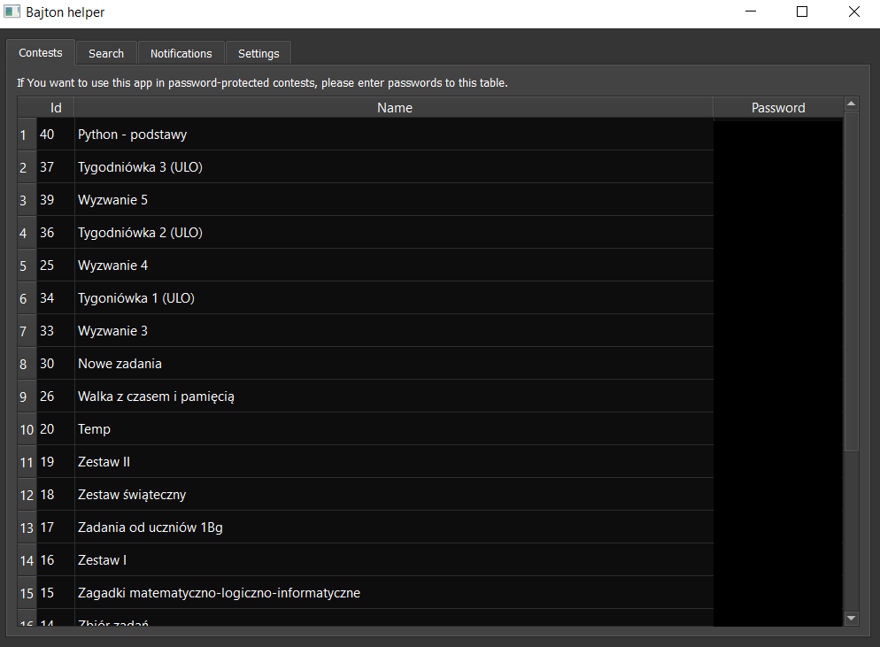
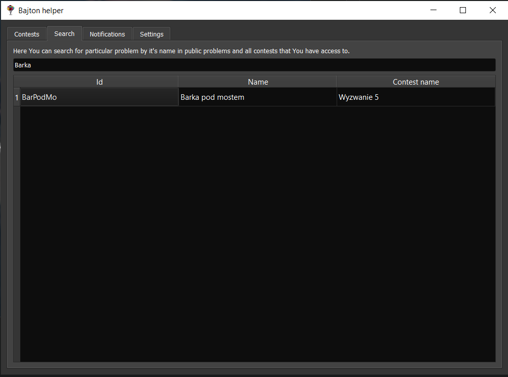
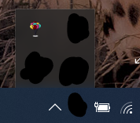

# Bajton Helper
Get notifications about new problems, auto-solve based on history and search functionality!
## Features
### Password manager
Never forget passwords to Your contests! You can also export passwords list and share it with Your classmates.

### Search engine
You can search problems by name or id's. You can also use "auto-solve" function to check if You have already completed the same problem in other contests.

### Notifications
Get notifications about public and contests problems. Also run "auto-solve" to focus only on new problems!

## Setup
1. [Download app source code](https://github.com/PetrusTryb/bajton-helper/archive/master.zip).
2. Extract the code somewhere on Your computer.
3. Install Python 3.8 from [Python website](https://www.python.org/ftp/python/3.8.4/python-3.8.4.exe) or from [Microsoft Store](ms-windows-store://assoc/?FileExt=py). Remember to check option "add Python to PATH" if visible.
4. Open Command Prompt. To do this, open File Explorer, navigate to directory with extracted app, and type `cmd` in address bar.
5. Install required modules using: `pip3 install -r requirements.txt`
6. Launch the app using command `pythonw3 main.py`

## Reporting problems
Please report all problems with app using [Issues](https://github.com/PetrusTryb/bajton-helper/issues) on GitHub. 
**Important:** never share Your props.ini file or console logs without removing Your session id or other sensitive data.

I am not responsible for improper use of this app or it's modifications.