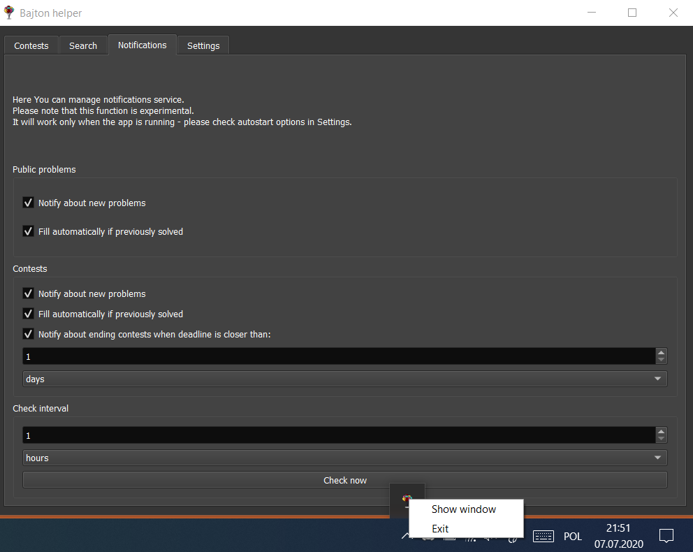

# Bajton Helper
Otrzymuj powiadomienia o nowych zadaniach na Bajtonie, przesyłaj automatycznie te już rozwiązane i wyszukuj je!
## Funkcje
### Menedżer haseł
Nigdy nie zapomnisz haseł do swoich konkursów! Możesz potem łatwo je wyeksportować i wysłać znajomym.

### Wyszukiwarka zadań
Możesz wyszukiwać zadania po ich nazwach bądź identyfikatorach. Skorzystaj z funkcji "wyszukaj rozwiązanie", aby przesłać automatycznie zadania, które rozwiązałeś już kiedyś w innych konkursach.

### System powiadomień
Otrzymuj powiadomienia, gdy tylko pojawi się jakieś nowe zadanie, lub gdy konkurs dobiega końca. Automatycznie uruchom funkcję wyszukiwania rozwiązania, aby skupić się tylko na nowych zadaniach!

## Instalacja
1. Pobierz [archiwum z kodem źródłowym](https://github.com/PetrusTryb/bajton-helper/archive/master.zip).
2. Rozpakuj je gdzieś na swoim komputerze.
3. Zainstaluj oprogramowanie Python 3.8 ze [strony](https://www.python.org/ftp/python/3.8.4/python-3.8.4.exe) lub [sklepu Microsoft](ms-windows-store://assoc/?FileExt=py). Zaznacz opcję "add Python to PATH", jeśli jest widoczna.
4. Otwórz Wiersz Polecenia. Aby to zrobić, otwórz folder, do którego rozpakowałeś archiwum z kodem w Eksploratorze i wpisz `cmd` w pasku adresu.
5. Zainstaluj wymagane biblioteki, wpisując polecenie: `pip3 install -r requirements.txt`
6. Uruchom aplikację: `pythonw3 main.py`

## Zgłaszanie problemów
Problemy z aplikacją można zgłaszać przy użyciu funkcji [Issues](https://github.com/PetrusTryb/bajton-helper/issues) na GitHubie. 
**Ważne:** nigdy nie udostępniaj logów ani plików konfiguracyjnych bez usunięcia z nich swojego identyfikatora sesji - pozwala on na przejęcie kontroli nad Twoim kontem.

Nie ponoszę odpowiedzialności za nieprawidłowe użycie tej aplikacji lub jej zmodyfikowanej wersji.